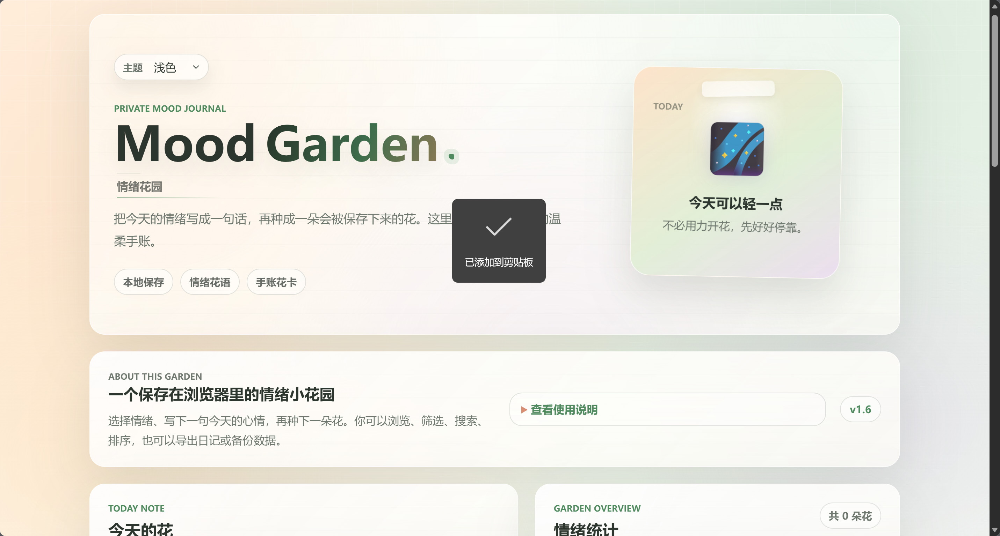
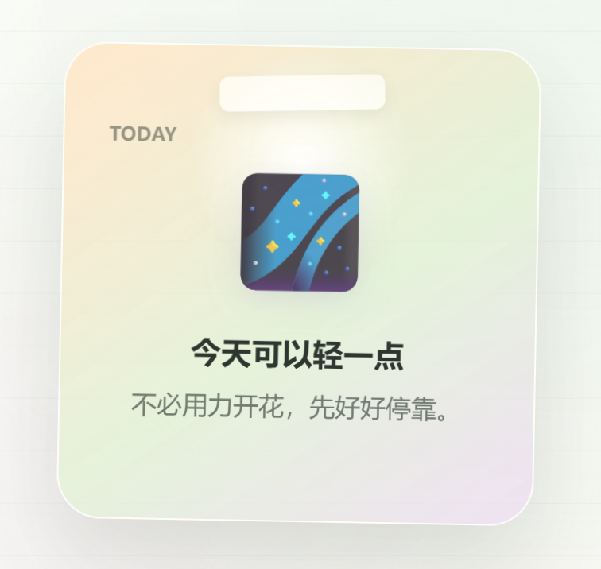
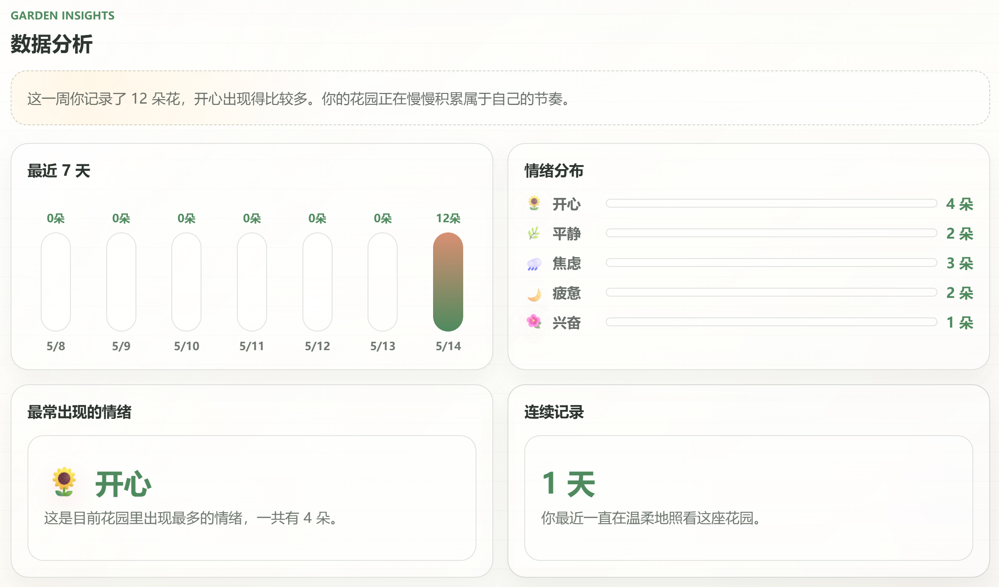
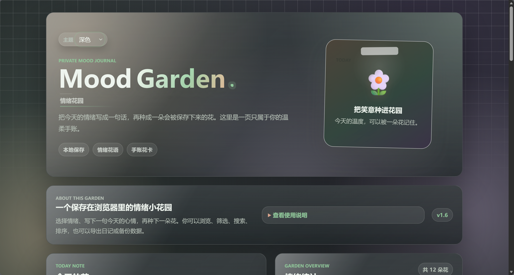

# Mood Garden 情绪花园

Mood Garden 情绪花园是一个使用 **HTML、CSS、JavaScript** 从零完成的前端小作品。它把每天的心情记录成一张情绪花卡片，支持本地保存、随机花语、动态图标、筛选搜索排序、数据分析、导入导出、主题切换、移动端分区浏览和基础 PWA 离线访问。

在线访问地址：[https://hellplus.github.io/mood-garden/](https://hellplus.github.io/mood-garden/)

## 项目简介

这是一个偏温柔、治愈风格的轻量情绪记录页面。用户可以选择今天的情绪，写下一句心情，然后种下一朵属于当天的花。每张花卡片会保存在浏览器 `localStorage` 中，刷新页面后仍然可以继续查看。

项目没有使用 React、Vue、构建工具或后端服务，主要用于练习原生前端开发中的页面结构、样式设计、DOM 操作、本地存储、数据渲染、PWA 基础能力和 GitHub Pages 发布流程。

本项目只用于个人情绪记录和前端学习展示，不提供心理诊断或医疗建议。

## 项目截图









## 主要功能

- 选择今日情绪：开心、平静、焦虑、疲惫、兴奋。
- 写下一句今天的心情，并生成情绪花卡片。
- 根据情绪生成随机今日花语。
- 每种情绪有独立图标池，种花时随机生成对应情绪图标。
- 花卡片、Hero 图标和部分统计图标带有轻量动画。
- Hero 区图标和文案会根据当前情绪动态变化。
- 使用 `localStorage` 保存花卡片，刷新后自动恢复。
- 支持编辑单条心情文字、删除单张花卡片、清空花园。
- 支持按情绪筛选、关键词搜索、最新优先 / 最早优先排序。
- 显示当前筛选结果数量。
- 支持导出 `.txt` 情绪日记。
- 支持导出和导入 JSON 备份，导入时可选择合并或覆盖。
- 显示情绪统计、最近 7 天记录、情绪分布、最常出现情绪、连续记录天数和本周回顾。
- 支持浅色、深色、治愈粉三种主题，并保存主题偏好。
- 使用 Toast 轻提示反馈操作结果。
- 支持空花园状态、无搜索结果状态和响应式布局。
- 手机端使用记录 / 花园 / 分析 / 数据四个区域和底部导航，降低信息拥挤。
- 支持基础 PWA：manifest、应用图标、service worker 和核心文件离线缓存。
- 首次打开时显示简短使用引导。

## 使用技术

- HTML
- CSS
- JavaScript
- localStorage
- PWA Manifest
- Service Worker
- GitHub Pages

没有使用第三方框架、构建工具、后端服务或图表库。

## 本地运行方式

这个项目可以直接在浏览器中运行：

1. 下载或克隆项目到本地。
2. 找到项目目录中的 `index.html`。
3. 双击 `index.html`，用浏览器打开即可。

如果想测试 PWA 和 service worker，建议使用 VS Code 的 Live Server 或其他本地静态服务器打开项目。直接双击 `index.html` 时，页面功能可以运行，但浏览器不会在 `file://` 页面注册 service worker。

## 数据说明

- 所有花卡片数据都保存在当前浏览器的 `localStorage` 中。
- 刷新页面后，历史花卡片会从 `localStorage` 中恢复。
- 更换浏览器、清理浏览器数据、换设备或使用无痕模式，可能看不到原来的记录。
- 点击“清空花园”会删除当前浏览器里的花卡片记录。
- “导出日记”会下载 `.txt` 文本文件，适合阅读和保存。
- “导出备份”会下载 JSON 数据文件，之后可以通过“导入备份”恢复或合并记录。
- 首次使用引导和主题偏好使用单独的 `localStorage` key，不会改变花卡片数据结构。

## 项目结构

```text
mood-garden/
├── assets/
│   ├── icon.svg
│   ├── mood-garden-hero.png
│   ├── mood-garden-cards.png
│   ├── mood-garden-analytics.png
│   └── mood-garden-theme.png
├── index.html
├── style.css
├── script.js
├── manifest.webmanifest
├── service-worker.js
├── CHANGELOG.md
└── README.md
```

文件说明：

- `index.html`：页面结构，包括 Hero、记录区、统计区、分析区、浏览区、花园列表、移动端分区、使用说明和发布信息。
- `style.css`：页面样式，包括主题变量、响应式布局、花卡片、按钮、数据分析、PWA 引导和动画效果。
- `script.js`：页面交互逻辑，包括种花、保存读取、筛选搜索、编辑删除、导入导出、主题切换、PWA 注册和数据分析。
- `manifest.webmanifest`：PWA 应用名称、图标、启动路径和显示模式配置。
- `service-worker.js`：缓存核心静态文件，支持基础离线访问。
- `assets/`：项目截图和应用图标。
- `CHANGELOG.md`：版本迭代记录。
- `README.md`：项目说明文档。

## 版本迭代

主要版本变化整理在 [CHANGELOG.md](CHANGELOG.md) 中。

当前展示版本：`v2.0`

简要记录：

- `V1.0`：基础情绪记录和 `localStorage` 保存。
- `V1.1`：筛选、搜索、排序和结果数量。
- `V1.2`：JSON 备份导出与导入。
- `V1.3`：主题、Toast、视觉体验和交互动画。
- `V1.4`：数据分析、动态图标和 Hero 动态文案。
- `V1.5`：配置、存储、渲染流程和代码整理。
- `V1.6`：发布质量、README、CHANGELOG 和页面说明整理。
- `V1.7`：README、项目说明、发布检查清单和学习复盘文档整理。
- `V1.8`：移动端信息架构优化，增加记录 / 花园 / 分析 / 数据底部导航。
- `V2.0`：PWA 基础支持、离线缓存、首次使用引导和本地数据说明。

## 学习收获

通过这个项目，我主要练习了：

- 如何用 HTML、CSS、JavaScript 拆分一个完整页面。
- 如何用 JavaScript 处理按钮点击、输入框和选择器。
- 如何使用 `localStorage` 保存、读取和清空本地数据。
- 如何兼容旧数据字段，例如缺少 `id`、`flowerQuote` 或 `moodIcon`。
- 如何用数组和对象组织情绪、花语、图标和文案配置。
- 如何实现筛选、搜索和排序，但不改变原始数据。
- 如何生成 `.txt` 日记和 JSON 备份文件。
- 如何读取用户上传的 JSON 文件并做基础格式校验。
- 如何用 CSS 变量实现多主题切换。
- 如何用 CSS `keyframes` 制作轻量动画，并支持 `prefers-reduced-motion`。
- 如何做简单的数据统计和规则化回顾文案。
- 如何整理常量配置、存储函数和统一刷新流程。
- 如何根据屏幕尺寸调整页面信息架构。
- 如何用移动端 tab 降低长页面复杂度。
- 如何区分核心记录功能和导入导出等高级功能。
- 如何添加基础 PWA manifest 和 service worker。
- 如何让项目在 GitHub Pages 上保持相对路径兼容。
- 如何为项目准备 README、CHANGELOG 和上线前检查清单。

## 注意事项

Mood Garden 情绪花园是一个轻量情绪记录工具，页面中的统计和回顾只基于用户自己写下的记录生成，不提供心理诊断、医疗建议或治疗服务。如果你正在经历持续的痛苦、焦虑或其他严重困扰，请及时联系可信任的人或专业支持。

## 后续可升级方向

- 增加按日期筛选或日历视图。
- 增加单条记录的更多字段，例如天气、地点或标签。
- 增加更详细的导入报告。
- 增加更丰富但仍然轻量的图表展示。
- 进一步完善 PWA 安装提示和版本更新体验。
- 尝试改写为 React 或 Vue 版本，用来练习框架开发。
